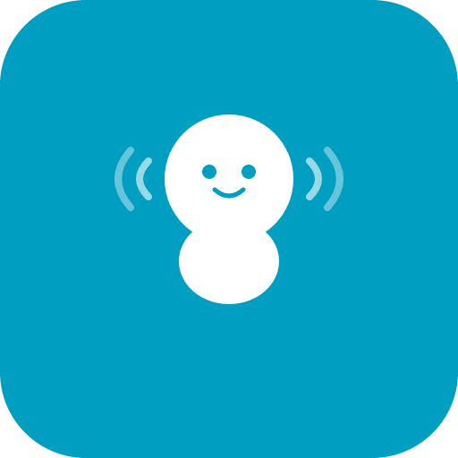

<p align="center">
  
</p>

<h1 align="center">Baby Monitor</h1>

<p align="center">
  <strong><a href="https://babymonitor.online">babymonitor.online</a></strong>
</p>

Privacy-first, peer-to-peer audio baby monitor that runs entirely in the browser. No accounts, no servers storing your audio, no tracking.

Built with [Next.js](https://nextjs.org), bootstrapped with [v0](https://v0.dev) and [Claude Code](https://claude.ai/code).

## How It Works

1. **Start Monitoring** on the device near the baby (sender)
2. A **QR code** appears instantly -- scan it with your phone (receiver)
3. The sender **approves** the connection request
4. Audio streams **directly between devices** via WebRTC -- no server in the middle

```
Sender (Baby)                    Receiver (Parent)
    |                                |
    |--- QR Code / Link ----------->|
    |                                |
    |<-- Connection Request ---------|
    |    (device type + IP shown)    |
    |                                |
    |--- Approve / Reject --------->|
    |                                |
    |<=== Encrypted Audio (P2P) ===>|
    |    (WebRTC, no server)         |
```

## Features

- **Instant QR** -- QR code shows immediately, mic setup runs in background
- **Discover nearby** -- find monitors on the same network automatically
- **Baby name + PIN** -- name your monitor, set an optional PIN for quick secure access
- **Sender approval** -- sender sees device type and IP of each connection request
- **Same network mode** -- restrict access to devices on the same WiFi
- **Session locking** -- after first approval, no other device can connect
- **Reconnect** -- receiver can disconnect and reconnect within 30 minutes (auto-approved, same browser only)
- **Muted by default** -- receiver starts muted with always-visible audio waveform
- **AI Monitor** -- local Whisper + Claude CLI detects crying and sends notifications
- **Session cleanup** -- when sender stops, the session is deleted and receiver is notified
- **PWA** -- installable on mobile as a native-like app
- **Privacy** -- audio never touches a server; signaling data auto-expires

## Tech Stack

- **Next.js 16** (App Router, Turbopack)
- **React 19**
- **WebRTC** for peer-to-peer audio
- **Web Audio API** for real-time level metering
- **Upstash Redis** for signaling (deployed) / in-memory (local dev)
- **shadcn/ui** + **Tailwind CSS** for UI
- **qrcode.react** for QR generation

## Getting Started

### Local Development

```bash
pnpm install
pnpm dev
```

Open [http://localhost:3000](http://localhost:3000). To test with a second device on the same WiFi, the app automatically detects your local network IP and uses it in the QR code.

### Deploy to Vercel

The app deploys to [Vercel](https://vercel.com) with one click. You need to provision **Upstash Redis** for signaling to work across serverless function instances:

```bash
vercel link
vercel integration add upstash/upstash-kv
vercel env pull .env.local
```

Environment variables needed (auto-provisioned by the integration):
- `KV_REST_API_URL`
- `KV_REST_API_TOKEN`

## Architecture

### Signaling

WebRTC requires a signaling server to exchange connection details (SDP offers/answers, ICE candidates). This app uses:

- **Upstash Redis** (deployed) -- persists across serverless invocations, auto-expires via TTL
- **In-memory Map** with `globalThis` (local dev) -- survives HMR reloads

The signaling server only handles the brief initial handshake. Once connected, audio flows directly between devices.

### Security Model

- **Sender approval required** -- every new listener must be explicitly approved
- **Session locking** -- after first approval, the session rejects all other devices
- **Browser binding** -- the approved receiver's ID is stored in `localStorage`, only that browser can reconnect
- **Auto-expiry** -- sessions expire after 30 minutes of the last activity
- **Sender cleanup** -- stopping the sender immediately deletes the session

## Project Structure

```
app/
  page.tsx              Sender (home page)
  receiver/page.tsx     Receiver (parent side)
  privacy/page.tsx      Privacy policy
  api/signal/route.ts   Signaling API (offer/answer/listeners/discover)
  api/network/route.ts  Local IP detection (dev mode only)
hooks/
  use-webrtc.ts         WebRTC sender + receiver hooks
  use-ai-monitor.ts     AI monitor hook (VAD, recording, bridge)
components/
  audio-waveform.tsx    Animated waveform visualizer
  status-indicator.tsx  Connection status display
  qr-display.tsx        QR code with copy link
baby-monitor-ai.py     AI bridge server (Whisper + Claude CLI)
```

## AI Monitor (Experimental)

Get intelligent alerts when your baby cries, wakes up, or needs attention — powered by local Whisper transcription + Claude Code CLI.

```
Browser (audio) → Whisper (local, free) → Claude CLI (classify) → Notification
```

### Setup

```bash
pip install openai-whisper
brew install ffmpeg
python3 baby-monitor-ai.py
```

No API keys needed. Whisper runs locally on your machine (free), Claude uses your existing Claude Code CLI session.

### How It Works

1. The receiver page auto-detects the AI bridge running on your network
2. Enable **AI Monitor** in the connected state — choose "Crying only" or "Any sound"
3. When sound is detected (VAD in browser), 5 seconds of audio is captured
4. Audio is sent to the local bridge which:
   - Converts to WAV via ffmpeg
   - Transcribes locally with Whisper (no API calls)
   - Extracts volume stats + no-speech probability
   - Sends the transcript to `claude -p` for classification
5. You get a browser notification if the baby needs attention

### Classification

The AI classifies audio into: **sleeping**, **crying**, **fussing**, **babbling**, **coughing**, or **noise**.

Whisper's `no_speech_prob` is key — baby crying scores high (it's not speech), combined with volume levels and transcript content for accurate detection.

### Options

```bash
python3 baby-monitor-ai.py --model tiny    # fastest, less accurate
python3 baby-monitor-ai.py --model base    # default, good balance
python3 baby-monitor-ai.py --model small   # most accurate, slower
python3 baby-monitor-ai.py --port 9877     # default port
```

### Architecture

```
hooks/use-ai-monitor.ts    React hook — VAD, recording, bridge detection
baby-monitor-ai.py         Local Python server — Whisper + Claude CLI bridge
```

The bridge runs on `0.0.0.0:9877` so any device on your network can use it. The receiver page checks `localhost:9877` on load and shows the AI Monitor option if available.

## Privacy & Legal

Full [Privacy Policy](https://babymonitor.online/privacy) available on the site, covering:

- **GDPR compliance** — No persistent personal data stored; auto-expiring sessions; right to erasure honored automatically
- **CCPA compliance** — No personal information sold or shared for advertising
- **End-to-end encryption** — Audio encrypted via WebRTC DTLS-SRTP, never touches our servers
- **Children's privacy** — No personal information collected from any user
- **Third-party services** — Only Vercel (hosting), Upstash (temporary signaling), Google STUN (connection setup)

## License

MIT

